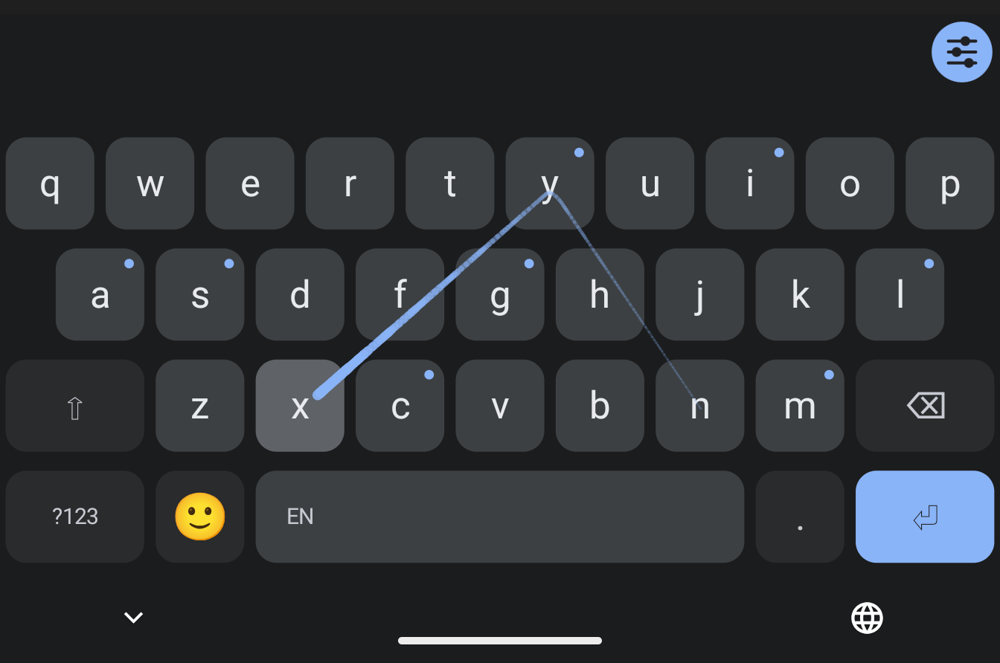
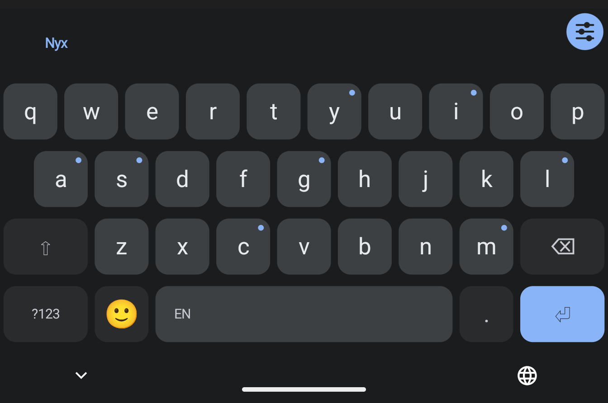

# Nyx

An Android keyboard for **two thumbs at once**. Each thumb can tap or swipe,
whenever it likes, in the middle of the same word, and Nyx puts the pieces
back together into one word. It's a spiritual successor to Nintype
(Keyboard69).

Typing **something**:

- Left thumb taps `S`
- Right thumb swipes `O → M`
- Left thumb taps `E`, while the right thumb starts on `T → H → I → N → G`
- Nyx reads it as **something**

  
  

There's no "one gesture per word" rule and no timer guessing when you've
finished. A word is whatever you typed between two spaces, however many taps
and swipes that took, from either hand.

**Everything stays on your phone.** Nyx has no internet permission at all,
so nothing you type can leave the device. Decoding, prediction and learning
all run locally, and password fields switch suggestions and learning off
entirely.

> **This is a beta.** It's my daily keyboard and a small group has been
> testing it since August, but expect rough edges. Bug reports are very
> welcome. See [Feedback](#feedback).

## Install

1. Open the [latest release](https://github.com/RegalOdin/nyx-beta/releases/latest)
   on your phone and tap `Nyx-<version>-beta.apk` under **Assets**.
2. Open the download. Android will ask you to allow installs from your
   browser; allow it for this one install.
3. Open the **Nyx** app icon. It takes you straight to Android's keyboard
   list: switch **Nyx** on there.
4. In any text box, pick Nyx with the keyboard switcher (the small keyboard
   icon at the bottom of the screen, or *Settings → System → Keyboard*).

**Updating:** install the new APK over the old one. **Don't uninstall
first**, or you'll lose your saved snippets, the words it has learned from
you, and your keyboard height and colours. If the keyboard looks unchanged
after an update, restart the phone. Android sometimes keeps the old one
running until you do.

Android will say the app is from an unknown developer. That's because it
isn't on the Play Store. Every release is signed with the same key, so
updates install over each other.

## How it types

- **Tap, swipe, or both, in one word.** Pieces from both thumbs are put in
  order by *when each one started*, so a tap made halfway through the other
  thumb's swipe lands where it belongs.
- **Reads the whole sentence.** When a swipe could be two words, a small
  language model on your phone looks at the sentence so far and picks the
  one that fits. A swipe that clearly meant one word still gets that word.
- **Learns you.** Words you use often, and the words you put after them,
  slowly rank higher. A word you keep rejecting loses ground twice as fast
  as it gained it. Incognito tabs and other "don't learn" fields are
  respected.
- **Learns your aim.** Taps on words you accept nudge each key's centre
  toward where your thumb actually lands.
- **Delete it and retype it, and Nyx offers something else.** Typing the
  same thing twice says "not that one", and the word you rejected moves to
  the back of the list.
- **Six languages:** English, Spanish, Italian, French, German and Russian
  (ЙЦУКЕН layout). Accented words come out right from a plain swipe: swipe
  `anos`, get `años`.

## Keys and gestures

| Do this | To get |
|---|---|
| Hold a letter | Its accents (`n` → `ñ`), plus the snippet saved on it |
| Select text, then hold a letter | Save the selection on that key as a snippet (one per key) |
| Hold space, tap a letter | Paste that key's snippet |
| Hold shift | **Title** the last word, or the one the cursor is on. Keep holding for **CAPS**. Do it again to undo |
| Double-tap shift | Caps lock (the dot on the key means it's on) |
| Slide on the spacebar | Move the cursor. The bar offers fixes for each word you pass |
| Slide left on backspace | Select text to delete. Slide back to take some back, lift to delete |
| Backspace right after a word | Deletes the whole word; after a space, one character |
| Hold the period | `. ? !` |
| Hold the left end of the spacebar | Switch language |
| Long-press a suggestion | Offer to add it to your dictionary |
| Drag the handle on the suggestion bar | Resize the keyboard |

Also:

- **Emoji page** with eight tabs of thirty (no endless scrolling) and recents.
- **Typing speed** in words per minute on the right of the spacebar.
- **Stacked suggestions** (optional): the last few words of the sentence,
  each with its two runners-up above and below, so you can fix an earlier
  word with a flick.
- **Your own colours**: pick three (keys, lettering, accent) and Nyx works
  out the rest, keeping every label readable.
- **Haptics by cost**: letters tick lightly, while backspace and the other edge
  keys click harder, so your thumb knows it left the letters.
- **Settings live inside the keyboard** (the round button at the right of
  the suggestion bar). Every switch is on by default.

## Requirements

Android 8.0 or newer. Tested daily on a Pixel 9 Pro XL (Android 17).

The download is about 44 MB, mostly the six sentence models (about 6 MB
each).

## Feedback

[Open an issue](https://github.com/RegalOdin/nyx-beta/issues) or find me on
r/nintype. The most useful report for a bad word is:

- what you meant
- what you got
- the few words just before it
- whether it was tapped, swiped, or both

## About this repo

This repository holds the release APKs and their changelogs only. Each
[release](https://github.com/RegalOdin/nyx-beta/releases) lists what changed.
The source code isn't public.

## Credits

- **Nintype**, for showing what two-thumb typing could be.
- **[Kinetica](https://github.com/EZ-eta/kinetica)** by EZ-eta, the other
  Nintype successor. Nyx's engine was rebuilt around an idea Kinetica
  showed works: merging the two thumbs by timestamp. Nyx is a separate
  codebase and contains none of Kinetica's code.
- Word frequencies from
  [hermitdave/FrequencyWords](https://github.com/hermitdave/FrequencyWords)
  (MIT), counted from OpenSubtitles.
- The sentence models are trained on OpenSubtitles text from
  [OPUS](https://opus.nlpl.eu/): P. Lison and J. Tiedemann (2016),
  *OpenSubtitles2016: Extracting Large Parallel Corpora from Movie and TV
  Subtitles*, LREC 2016, and <http://www.opensubtitles.org/>. Only the
  learned weights ship, and no subtitle text is included.
- Word-pair statistics from the [Tatoeba Project](https://tatoeba.org),
  released under [CC BY 2.0 FR](https://creativecommons.org/licenses/by/2.0/fr/).
  Only counts are included, and no Tatoeba sentence is reproduced.
